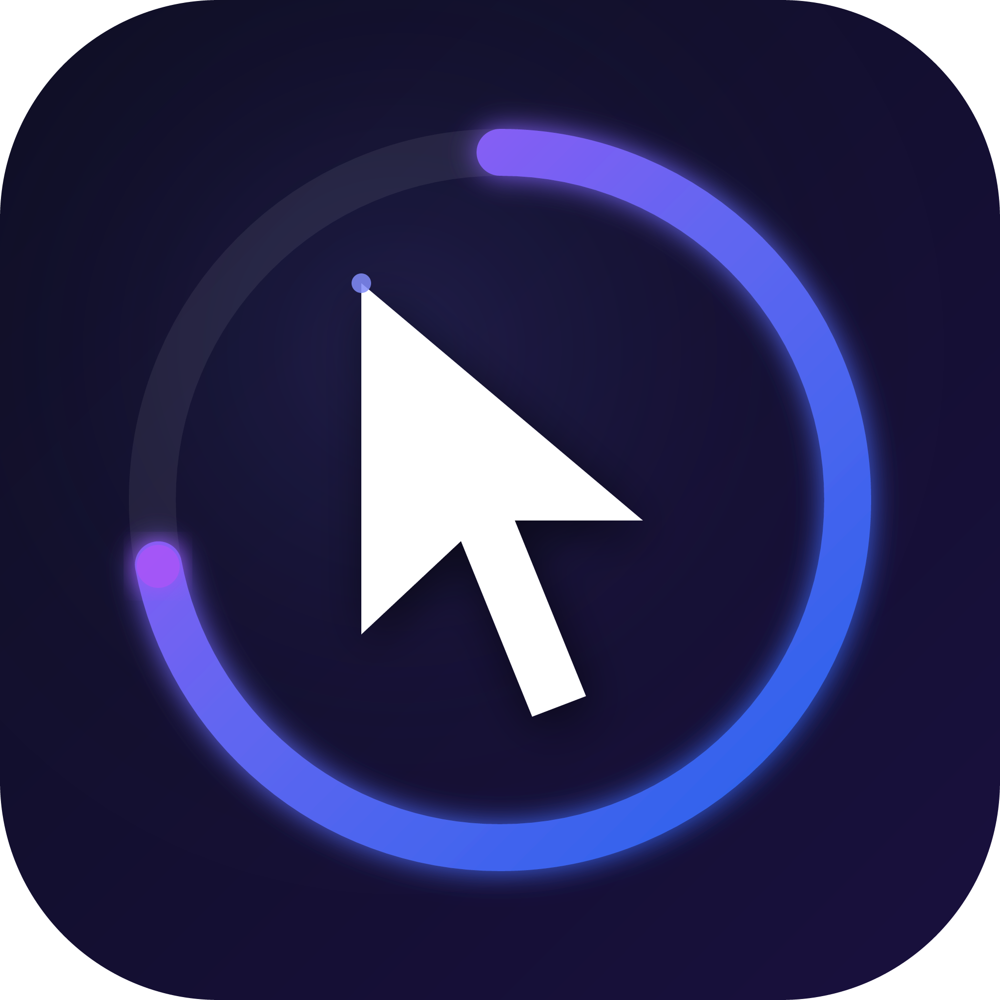
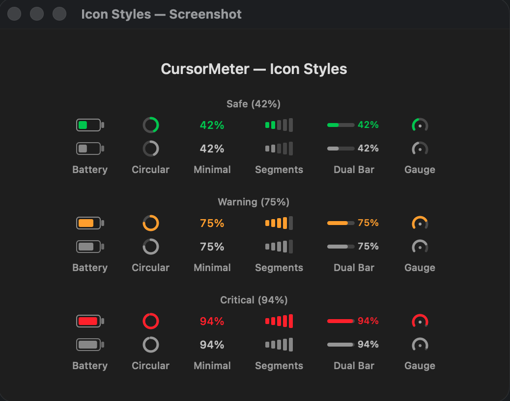
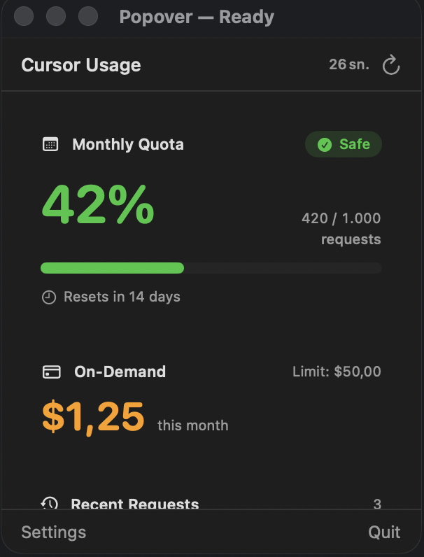
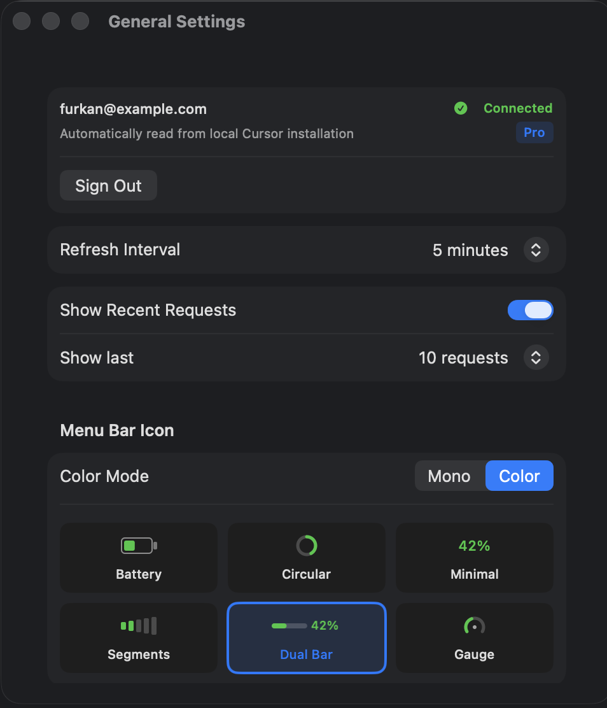
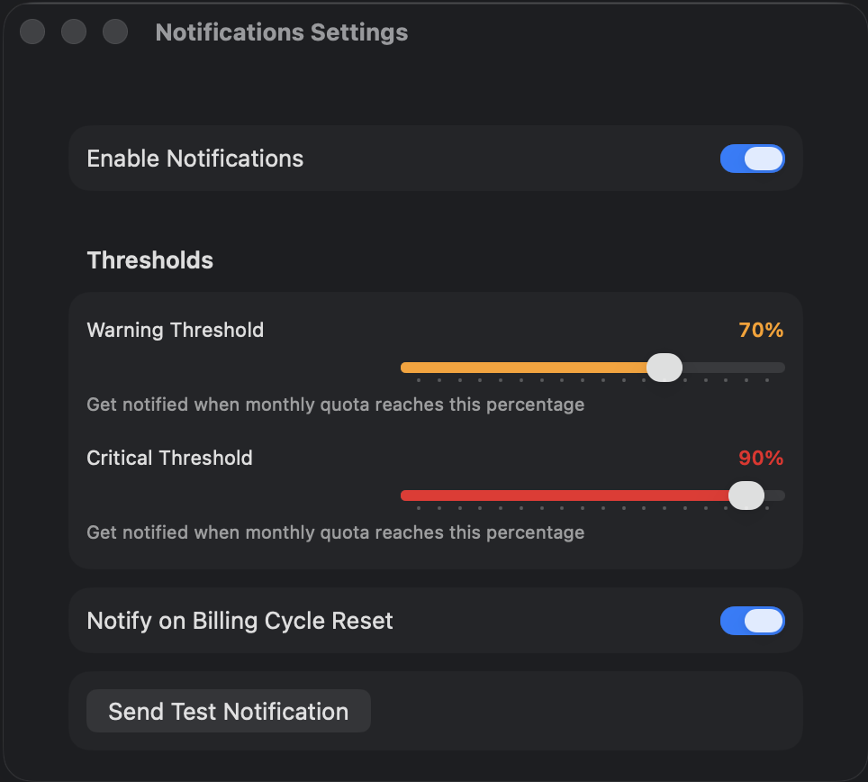
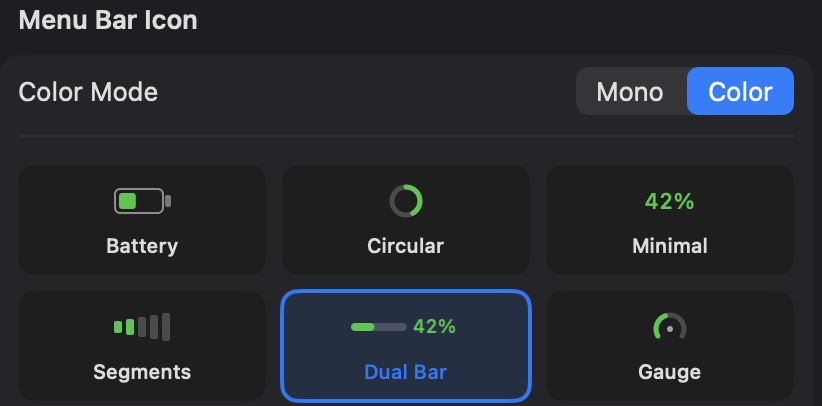

# CursorMeterFS

<p align="center">
  
</p>

<p align="center">
  <strong>Monitor your Cursor AI quota in real time — zero setup required.</strong><br>
  Lives in your macOS menu bar, detects your account automatically, always in sight.
</p>

<p align="center">
  
  
  
  
</p>

---

## Screenshots

<p align="center">
  
  &nbsp;&nbsp;
  
</p>

<p align="center">
  
  &nbsp;&nbsp;
  
</p>

<p align="center">
  
</p>

---

## Why CursorMeterFS?

Instead of opening Cursor's web dashboard, a single glance at your menu bar tells you how much of your monthly quota you've used, which model consumed how many tokens, and what you've spent.

| | CursorMeterFS | cursor.com/dashboard |
|---|---|---|
| Always visible | ✅ | ❌ (requires opening a browser) |
| Notifications | ✅ Alerts on threshold breach | ❌ |
| Recent requests | ✅ Model + tokens + cost | ✅ |
| No session login needed | ✅ Auto-detected | — |
| Third-party dependencies | ❌ Zero | — |

---

## Features

### Zero-Setup Auth
If Cursor is already installed and you're signed in — nothing else is needed. CursorMeterFS reads Cursor's local database **read-only** and picks up your identity automatically. No copying session IDs, no pasting tokens.

### Dynamic Quota Tracking
Your monthly request limit is fetched from the API in real time. If your plan changes (Free → Pro, Pro → Ultra) the limit updates automatically — nothing is hardcoded.

### 6 Menu Bar Icon Styles
Pick the style that fits your menu bar best: **Battery**, **Circular**, **Minimal**, **Segments**, **Dual Bar**, **Gauge**. Each works in **Mono** (follows system color) or **Color** (green / orange / red) mode.

### Recent Request Details
See which model handled each request (GPT-4o, Claude Sonnet, etc.), how many tokens were used, and the approximate cost — all from the popover.

### Smart Notifications
- **70% (Warning):** "You've used a large portion of your quota"
- **90% (Critical):** "You've reached a critical level"
- **Reset:** Fresh-start notification when your monthly quota resets
- All thresholds are configurable; each notification fires at most once per billing cycle.

### On-Demand Spend Tracking
If usage-based billing is active, the popover shows your current monthly spend and the hard limit you've set.

### Secure by Design
Tokens are stored exclusively in the macOS Keychain, encrypted. The Cursor database is never written to. Network access is restricted to `cursor.com` only.

---

## Requirements

- **macOS 13.0 (Ventura)** or later
- **[Cursor](https://cursor.com)** installed and signed in (Free, Pro, or Ultra)
- **Xcode 15+** (for building from source)

---

## Installation

### Option 1 — Release DMG *(fastest)*

1. Download the latest `CursorMeterFS-vX.Y.Z.dmg` from the [Releases](../../releases) page.
2. Open the DMG → drag CursorMeterFS to **Applications**.
3. On first launch macOS may show an "unverified developer" warning:
   - Go to **System Settings → Privacy & Security → Open Anyway**.
4. The CursorMeterFS icon appears in your menu bar — done.

---

### Option 2 — Build from Source *(Xcode)*

#### 1. Install the dependency

```bash
brew install xcodegen
```

> Don't have Homebrew? [brew.sh](https://brew.sh)

#### 2. Clone the repo

```bash
git clone https://github.com/furkansarikaya/CursorMeterFS.git
cd CursorMeterFS
```

#### 3. Generate the Xcode project

```bash
xcodegen generate
```

#### 4. Open and run in Xcode

```bash
open CursorMeterFS.xcodeproj
```

Once Xcode opens:

1. Click the **CursorMeterFS** project in the left panel.
2. Go to **Signing & Capabilities**.
3. Select your Apple ID under **Team** — a *Personal Team* is free and sufficient.
4. Press **⌘R** to run.

Xcode will download any missing dependencies on the first build.

---

### Option 3 — Terminal Build & Run *(no Xcode UI)*

No admin rights required — useful when you can't install a DMG.

```bash
# 1. Dependency
brew install xcodegen

# 2. Clone
git clone https://github.com/furkansarikaya/CursorMeterFS.git
cd CursorMeterFS

# 3. Generate Xcode project
xcodegen generate

# 4. Build (unsigned — for local development)
xcodebuild \
  -scheme CursorMeterFS \
  -configuration Release \
  -destination "platform=macOS" \
  CODE_SIGN_IDENTITY="-" \
  CODE_SIGNING_REQUIRED=NO \
  build

# 5. Run
open "$(xcodebuild \
  -scheme CursorMeterFS \
  -configuration Release \
  -showBuildSettings 2>/dev/null \
  | awk '/BUILT_PRODUCTS_DIR/{print $3}')/CursorMeterFS.app"
```

> **Note:** An unsigned build runs only on your own Mac and cannot be submitted to the App Store.

---

## Permission Prompts

On first launch macOS may show a few permission dialogs — **these are expected and safe:**

| Permission | Why It's Needed | If You Deny |
|------------|----------------|-------------|
| **"CursorMeterFS wants to access data from other apps"** | Cursor's local database (`state.vscdb`) is read read-only to retrieve your session | Auto-detection won't work |
| **Keychain access** | The retrieved token is saved encrypted in the macOS Keychain so the database isn't read again on subsequent launches | The database is re-read on every launch |
| **Notification permission** | Alerts are sent when usage thresholds are crossed | Notifications won't appear; the app continues working |

> All permissions can be changed later under **System Settings → Privacy & Security**.

---

## Usage

### First Launch

When the app starts and Cursor is signed in, it detects your identity automatically and settles into the menu bar. **No login required.**

If no Cursor session is found, a **"Sign in to Cursor"** prompt appears on screen.

### Menu Bar Icon

| Color | Meaning |
|-------|---------|
| 🟢 Green | Quota is healthy (below 70%) |
| 🟠 Orange | Approaching the warning threshold |
| 🔴 Red | Critical — most of the quota has been consumed |

- **Left click** → Open / close the usage popover
- **Right click** → Quick menu (Refresh / Settings / Quit)

### Popover

The card that opens shows:

- **Monthly Quota:** Requests used / total + percentage bar + reset date
- **On-Demand:** Current monthly spend and hard limit (if active)
- **Recent Requests:** Model name, token count, approximate cost (optional)

---

## Settings

Open via right-click → **Settings**, or the gear icon at the bottom of the popover.

### General

| Setting | Description |
|---------|-------------|
| **Account** | Cursor email address and plan type (read automatically) |
| **Refresh Interval** | Adaptive (recommended — backs off automatically when idle, on Low Power Mode, or under thermal pressure) or a fixed interval (1 / 2 / 5 / 15 / 30 min / Manual) |
| **Show Recent Requests** | Display the last N requests in the popover |
| **Menu Bar Icon Style** | Battery / Circular / Minimal / Segments / Dual Bar / Gauge |
| **Icon Color Mode** | Mono (follows system color) / Color (green–orange–red) |
| **Export to JSON** | `~/.cursormeter/usage.json` — for integration with external tools |
| **Start at Login** | Launch automatically when your Mac starts |

### Notifications

| Setting | Description |
|---------|-------------|
| **Warning Threshold** | Send a warning notification at this percentage (default 70%) |
| **Critical Threshold** | Send a critical notification at this percentage (default 90%) |
| **Notify on Reset** | Notify when the monthly quota resets |
| **Send Test Notification** | Verify that notifications are working |

---

## How It Works

CursorMeterFS reads Cursor's local SQLite database **read-only**:

```
~/Library/Application Support/Cursor/User/globalStorage/state.vscdb
```

Nothing is written to the database. The retrieved token is saved encrypted in the macOS Keychain and read from there on subsequent launches.

### Technical Flow

```
state.vscdb  (read-only, one-time)
  └─ cursorAuth/accessToken  (JWT)
       └─ JWT.sub → userId
            └─ sessionToken = userId%3A%3AaccessToken
                 │
                 ├─ GET  cursor.com/api/usage?user=<userId>
                 │        → used / max requests / reset date
                 │
                 ├─ POST cursor.com/api/dashboard/get-monthly-invoice
                 │        → model / tokens / cost per request
                 │
                 └─ POST cursor.com/api/dashboard/get-hard-limit
                          → spending limit

Token → Keychain (encrypted, device-local)
NSStatusItem icon updated
Threshold crossed → Notification sent
```

### Token Security

| Topic | Behavior |
|-------|----------|
| Token storage | macOS Keychain only (`kSecAttrAccessibleWhenUnlockedThisDeviceOnly`) |
| Database access | `SQLITE_OPEN_READONLY` — writes are strictly impossible |
| Network | Only `https://cursor.com` (ATS-restricted, host validated on every call) |
| Logs | Token and email are never logged |
| JSON export | Only percentages, counts, and dates — no credentials |
| Third-party | No external Swift packages; Apple system frameworks only |

---

## Troubleshooting

### Auto-Detection Not Working

```bash
# Check whether Cursor's token exists (read-only)
sqlite3 ~/Library/Application\ Support/Cursor/User/globalStorage/state.vscdb \
  "SELECT key, length(value) FROM ItemTable WHERE key LIKE 'cursorAuth%';"
```

If a `cursorAuth/accessToken` row appears, the token is present. Restart Cursor, then click **Settings → Retry Detection** in CursorMeterFS.

> Don't copy and paste the token manually. CursorMeterFS handles this automatically and securely.

### Data Not Updating

- Right-click → **Refresh** to trigger a manual update.
- Cursor's API endpoints are unofficial and undocumented. They may change with a Cursor update. If data cannot be fetched, the last known values are displayed with an error badge.

### Notifications Not Arriving

Go to **System Settings → Notifications → CursorMeterFS** and verify that notifications are enabled. You can also confirm with the **"Send Test Notification"** button in Settings.

---

## Contributing

1. Fork this repository
2. Create a feature branch: `git checkout -b feature/my-feature`
3. Commit your changes
4. Open a pull request

The CI pipeline runs `xcodegen generate` + `xcodebuild` + unit tests automatically on every PR.

---

## Known Limitations

- Cursor's API endpoints are **unofficial and undocumented** and may break with a Cursor update.
- Auto-detection may not work if Cursor is installed in a non-standard location (outside `/Applications`).
- Some dashboard endpoints may not return quota data for Free plan accounts.

---

## License

MIT — see [LICENSE](LICENSE)

---

<p align="center">
  <em>Not affiliated with Cursor.</em>
</p>
